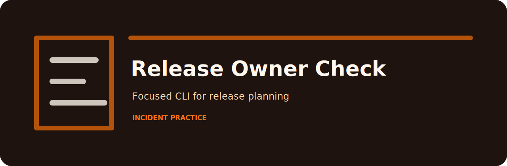
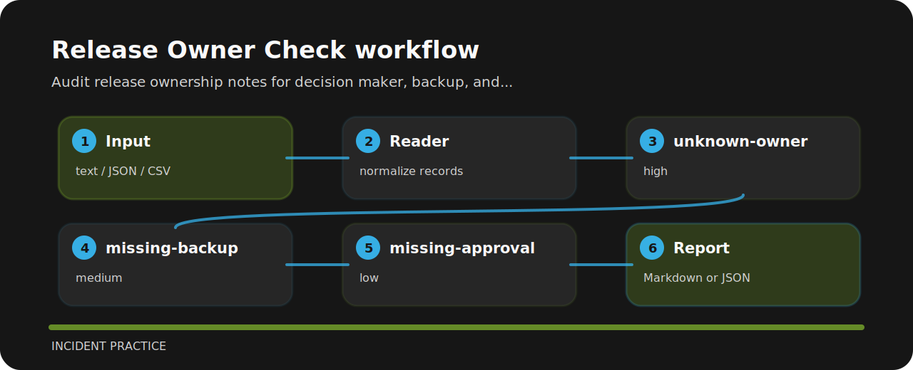

# Release Owner Check



## Use it when

Audit release ownership notes for decision maker, backup, and approval evidence. It keeps the review small: one input file, a short list of findings, and enough context to fix the line that caused the warning.

## Local check

```bash
git clone https://github.com/mertefekurt/release-owner-check.git
cd release-owner-check
python -m pip install -e ".[dev]"
release-owner-check examples/sample.txt
```

## Signal route



## Checks in plain language

| Signal | Level | What it flags | Fix direction |
| --- | --- | --- | --- |
| `unknown-owner` | high | release owner missing | assign release owner |
| `missing-backup` | medium | backup missing | assign backup owner |
| `missing-approval` | low | approval missing | record approval evidence |

## Check before changing

```bash
ruff check .
pytest
python -m release_owner_check --help
```
